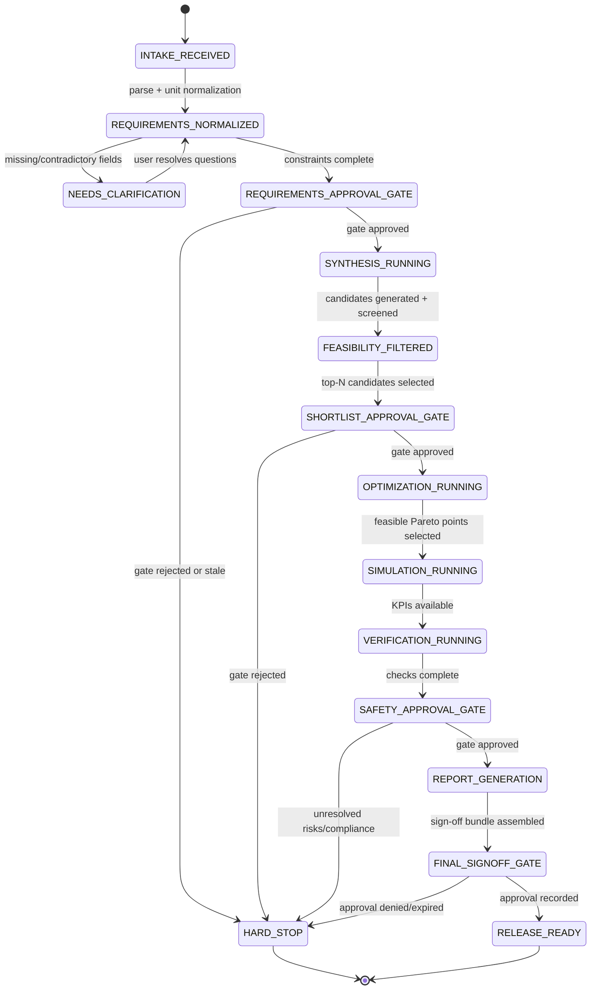
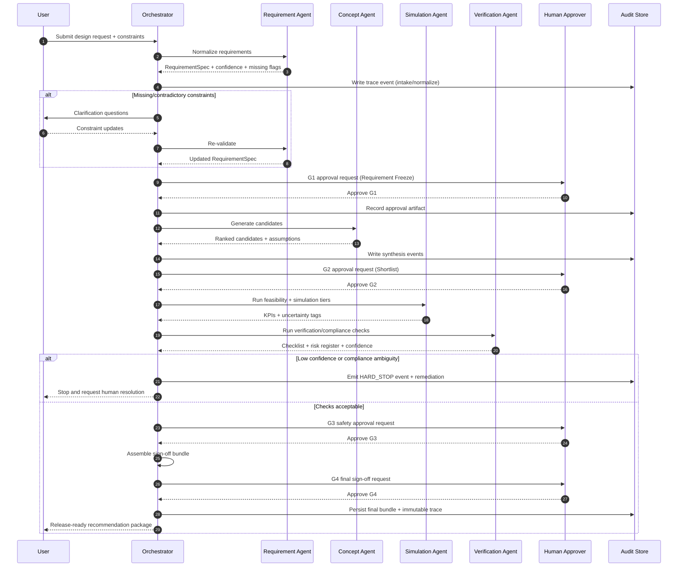

# AI System Design (V1)

This document defines how AI is used inside Dust Mechanica as a supervised, auditable engineering copilot system.

## Goals
- Translate user intent into verifiable engineering specifications
- Generate multiple feasible design concepts
- Coordinate simulation and optimization workflows
- Explain tradeoffs and risks clearly
- Keep human engineers in control for final sign-off

## Multi-Agent Roles

### 1) Requirement Interpreter Agent
**Purpose:** Convert natural-language requests and form inputs into typed, unit-aware requirement objects.

**Inputs:** user prompt, guided form values, prior project context

**Outputs:** normalized `RequirementSpec`, ambiguity flags, missing-field prompts

**Guardrails:**
- Never infer safety-critical values silently
- Require explicit user confirmation for defaults affecting load/safety/compliance

### 2) Concept Synthesis Agent
**Purpose:** Propose candidate topologies and component combinations.

**Inputs:** validated requirements + component catalog + compatibility rules

**Outputs:** ranked `CandidateDesign[]` with rationale and assumptions

**Guardrails:**
- Enforce compatibility and envelope constraints
- Emit rejection reasons for invalid concepts

### 3) Simulation Orchestrator Agent
**Purpose:** Select and execute appropriate analysis tiers.

**Inputs:** candidate designs, load cases, environment profiles

**Outputs:** simulation job specs, parsed KPIs, confidence tags

**Guardrails:**
- Run fast analytical checks before expensive solvers
- Mark outputs as preliminary when high-fidelity simulation is unavailable

### 4) Optimization Agent
**Purpose:** Search design space for Pareto-optimal solutions.

**Inputs:** variable bounds, objectives, constraints, candidate seeds

**Outputs:** Pareto set, sensitivity insights, dominated/non-dominated labels

**Guardrails:**
- Preserve hard constraints as non-negotiable
- Track reproducibility (seed, versioned formulas, solver config)

### 5) Verification & Safety Agent
**Purpose:** Validate margins, assumptions, and compliance mappings.

**Inputs:** optimized candidates + simulation/analytical outputs

**Outputs:** pass/fail checklist, risk register, required human approvals

**Guardrails:**
- No "safe" verdict without complete mandatory checks
- Highlight model limitations and uncertainty bounds

### 6) Report Generator Agent
**Purpose:** Produce user-ready engineering packages.

**Inputs:** final candidate package + verification artifacts

**Outputs:** design summary, BOM, CAD pointers, assumptions, next prototype actions

**Guardrails:**
- Include traceability links to calculations and solver runs
- Separate facts, assumptions, and recommendations clearly

## Agent Orchestration Flow
1. Intake request and normalize units
2. Resolve missing/conflicting requirements
3. Generate candidate concepts
4. Run analytical feasibility filters
5. Run optimization loop
6. Trigger deep simulation for top candidates
7. Run verification/safety checks
8. Generate report and request human sign-off

## Tool Access and Boundaries
- Requirement Interpreter: schema validators, unit converter, requirement history
- Synthesis Agent: topology library, component catalog, compatibility engine
- Simulation Agent: analytical solver + MBD/FEA adapters
- Optimization Agent: objective/constraint library, optimization backend
- Verification Agent: standards mapping, checklist engine, risk policy rules
- Report Agent: templating engine, artifact storage, export pipeline

No agent should bypass policy checks or directly mark a design production-ready.

## Memory and Context Strategy
- **Project memory:** persistent project specs, approved assumptions, past runs
- **Session memory:** temporary context for active design iteration
- **Artifact memory:** immutable references to CAD, simulation, and report outputs

All major decisions should be attached to:
- source inputs
- model/tool version
- timestamp
- responsible agent

## Human-in-the-Loop Control Points
Mandatory approvals:
1. Requirement freeze before optimization
2. Candidate shortlist before deep simulation budget spend
3. Pre-prototype safety review
4. Final engineering sign-off before release/manufacture

## Risk and Failure Handling
- Detect contradictory requirements and block progression
- Fall back to conservative assumptions when non-critical values are missing
- Escalate to user/engineer when uncertainty exceeds threshold
- Log solver failures with actionable retry guidance

## Traceability and Audit
For each final recommendation, store:
- requirement snapshot
- candidate generation rationale
- solver outputs and key KPIs
- optimization configuration and results
- verification checklist outcomes
- sign-off metadata

## MVP Implementation Sequence
1. Build Requirement Interpreter + typed schema contracts
2. Implement Concept Synthesis on 3-5 topologies
3. Add analytical feasibility + scoring
4. Integrate optimization and Pareto output
5. Add verification checklist + risk register
6. Add report generation with full traceability

## Agent Handoff State Machine and Retry Policy

### State Machine



### Retry Policy (Per State Transition)
- **Retry budget:** `max_retries_per_step = 2` for deterministic failures (timeouts, transient API 5xx, queue saturation), then escalate.
- **Backoff:** exponential `2^n` seconds with jitter in `[0, 500ms]`.
- **Idempotency key:** every retried action uses a stable `event_id` + `step_id` to prevent duplicate artifacts.
- **Retryable classes:**
  - tool/network transient failures
  - solver worker preemption
  - temporary model endpoint unavailability
- **Non-retryable classes (immediate hard stop):**
  - schema/constraint validation failures
  - policy/compliance ambiguity
  - low-confidence outputs below threshold with no new evidence
- **Escalation rule:** after budget exhaustion, transition to `HARD_STOP` with `escalation_reason` and required human action.

## Hard Stop Conditions

The orchestration layer must transition to `HARD_STOP` (no autonomous progression) under any of the following:

1. **Missing constraints**
   - Required safety/load/compliance constraint fields absent after clarification loop.
   - Conflicting constraints that cannot be reconciled (e.g., impossible envelope + load target).
2. **Low confidence**
   - Agent output confidence below configured threshold and no independent corroboration.
   - High disagreement between analytical and simulation tiers beyond tolerance.
3. **Compliance ambiguity**
   - Unknown jurisdiction/standard mapping for required checks.
   - Verification agent cannot map evidence to mandatory checklist controls.

**Hard-stop artifact requirements:**
- machine-readable stop code (`HARDSTOP_*`)
- human-readable rationale
- blocking fields/checklist items
- recommended remediation questions/actions

## Human Approval Gates and Required Artifacts

| Gate | Trigger | Approver | Required Artifacts |
|---|---|---|---|
| G1: Requirement Freeze | all mandatory fields present | Product + Lead Engineer | requirement snapshot, assumptions list, unresolved questions = 0 |
| G2: Candidate Shortlist | feasibility-filter complete | Lead Engineer | ranked candidates, rejection reasons, cost/performance tradeoff table |
| G3: Safety/Verification | verification checks complete | Safety/Compliance Engineer | checklist pass/fail, risk register, compliance mapping evidence |
| G4: Final Sign-off | report package assembled | Engineering Manager | sign-off bundle, decision log, release constraints, rollback/next-step plan |

**Gate policy controls:**
- Approvals are versioned and time-bound (`approval_ttl`).
- Any material input change invalidates downstream approvals and forces re-gating.
- No bypass path exists from pre-gate to post-gate states.

## Trace/Event Schema

Canonical event schema for all agent/tool actions:

```json
{
  "event_id": "uuid",
  "run_id": "uuid",
  "step_id": "string",
  "parent_event_id": "uuid|null",
  "timestamp_utc": "2026-05-28T12:34:56Z",
  "who": {
    "actor_type": "agent|tool|human",
    "actor_id": "string",
    "actor_version": "string"
  },
  "what": {
    "action": "string",
    "state_from": "string|null",
    "state_to": "string|null",
    "policy_checks": ["string"],
    "tags": ["handoff", "retry", "approval"]
  },
  "when": {
    "latency_ms": 0,
    "attempt": 1,
    "retry_of": "event_id|null"
  },
  "inputs": {
    "references": ["artifact://..."],
    "hashes": ["sha256:..."],
    "parameters": {}
  },
  "outputs": {
    "references": ["artifact://..."],
    "summary": "string",
    "status": "ok|warning|error"
  },
  "confidence": {
    "score": 0.0,
    "method": "self_eval|ensemble|calibrated_model",
    "threshold": 0.0,
    "decision": "accept|review|reject"
  }
}
```

### Minimum Required Fields by the Requested Dimensions
- **who:** `actor_type`, `actor_id`, `actor_version`
- **what:** `action`, `state_from`, `state_to`, `policy_checks`
- **when:** `timestamp_utc`, `latency_ms`, `attempt`
- **inputs:** artifact references + immutable hashes
- **outputs:** artifact references + status + summary
- **confidence:** numeric score + threshold + decision

## Determinism Controls

1. **Seed control**
   - Persist global run seed and per-step derived seeds (`seed_step = H(run_seed, step_id)`).
   - Require seed capture for all stochastic tools/solvers.
2. **Model/version pinning**
   - Pin model ID, provider, endpoint version, and prompt template version per step.
   - Block mixed-version comparisons unless explicitly marked exploratory.
3. **Replay capability**
   - Store complete event log + artifacts + config snapshots.
   - Support deterministic replay mode that reuses pinned versions, seeds, and inputs.
   - Produce replay diff report: output hashes, KPI deltas, and decision divergence.

## End-to-End Sequence (Input to Sign-off Bundle)


